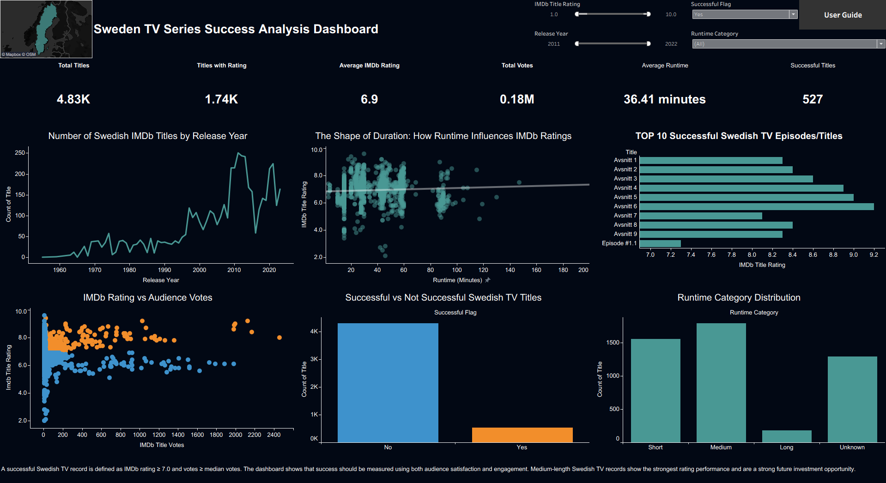

# Sweden TV Series Success Analysis

## Project Overview

This project analyzes Swedish TV title data using a historical IMDb dataset. The goal is to understand what makes a Swedish TV title successful and what types of television shows a broadcaster should invest in for the future.

The analysis was prepared using Python for data cleaning, exploration, and visualization. I used Pandas for data handling, NumPy for numerical calculations, and Matplotlib for creating charts.

## Business Questions

1. What makes a Swedish TV series successful?
2. What types of television shows should the broadcaster invest in for the future?

## Dataset

The analysis focuses on Swedish TV title records where the country code is `SE`.

Main tables used:

- fact_Title
- dim_Series
- fact_TitleRatings
- fact_SeriesRating
- fact_TitleAward
- fact_SeriesAward
- dim_TitleGenre
- dim_SeriesGenre

## Tools Used

- Python
- pandas
- numpy
- matplotlib
- Jupyter Notebook

## Key Analysis Steps

- Loaded and checked all dataset tables
- Cleaned rating, vote, runtime, and year columns
- Filtered Swedish title records
- Checked missing values and data quality
- Analyzed IMDb ratings and audience votes
- Created a success flag using rating and votes
- Analyzed release year trends
- Analyzed runtime categories
- Checked Sweden's age-rating distribution
- Reviewed award winner and nomination data
- Exported dashboard-ready data

## Success Definition

A Swedish TV title is considered successful when:

- IMDb rating is 7.0 or higher
- Number of votes is greater than or equal to the median vote count

This rule helps avoid using only high ratings from titles with very few votes.

## Final Business Insights

- The title-level dataset contains 4,829 Swedish TV title records.
- Around 64% of Swedish title records are missing IMDb rating and vote data, so rating-based conclusions were made only using available rating and vote records.
- The average IMDb rating for Swedish TV titles is 6.91, and the median rating is 7.0.
- Using the success rule, 527 Swedish TV titles were identified as successful.
- Medium-length titles are the strongest runtime category, with the highest average IMDb rating.
- The broadcaster should invest in medium-length Swedish TV shows with strong ratings and reliable audience vote counts.
- Future decisions should use rating, votes, runtime, release trend, age rating, and award recognition together instead of IMDb rating alone.

## Suggested Dashboard KPIs

- Total Swedish TV titles
- Average IMDb rating
- Total audience votes
- Number of successful titles
- Top successful titles
- Title count by release year
- Rating distribution
- Runtime category distribution
- Average rating by runtime category
- Sweden age-rating distribution
- Award winners vs nominations
- Missing values summary

## Dataset Limitation

The title-level analysis is directly Sweden-focused because the `fact_Title` table contains `Country Code = SE`.

Some supporting tables lack direct keys to clearly connect them to Swedish titles or series. Because of this, the analysis separates the direct Sweden analysis from the supporting dataset analysis.

## Files in This Repository

- `Sweden_TV_Series_Broadcaster_Analysis.ipynb` — Python analysis notebook

## Tableau Dashboard

I also created an interactive Tableau dashboard to support the business questions.

The dashboard helps users explore Swedish TV title performance using:

- Total Swedish TV titles
- Titles with IMDb ratings
- Average IMDb rating
- Total audience votes
- Average runtime
- Successful title records
- Release year trends
- IMDb rating vs audience votes
- Runtime category distribution
- Successful vs not successful records
- Top 10 successful Swedish TV records

### Dashboard Preview

### Tableau Dashboard File

The Tableau packaged workbook is included in this repository:

`Sweden_TV_Series_Tableau_Dashboard.twbx`

### How to Use the Dashboard

- Use the filters to explore IMDb rating, release year, success status, and runtime category.
- Successful records are defined as IMDb rating ≥ 7.0 and votes ≥ median votes.
- Use the scatter plot to compare audience rating and audience engagement.
- Use the runtime charts to identify which content length performs better.
- Use the top 10 chart to review examples of high-performing Swedish TV records.
- `sweden_tv_dashboard_data.csv` — cleaned dashboard-ready data
- `README.md` — project summary and business insights
